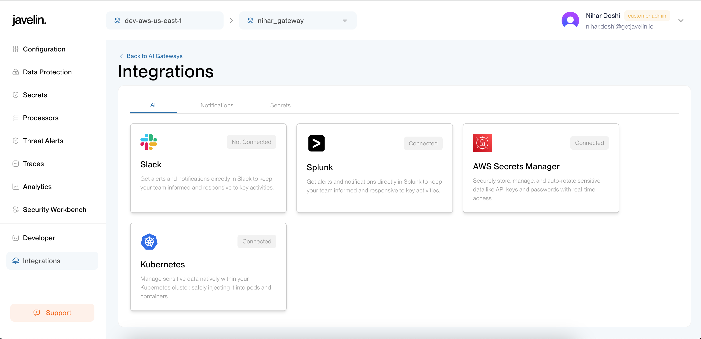
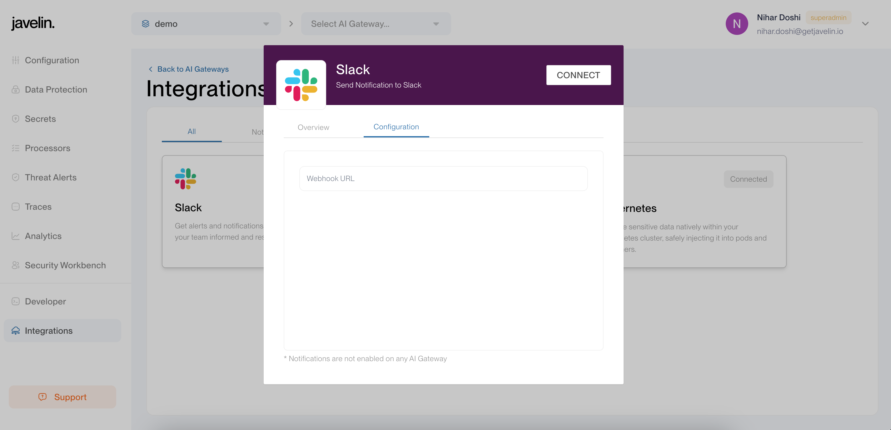
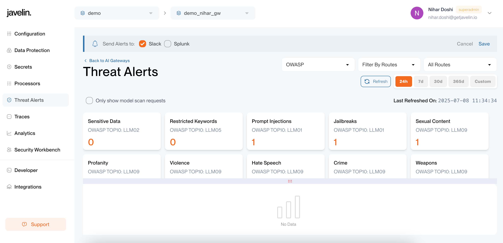
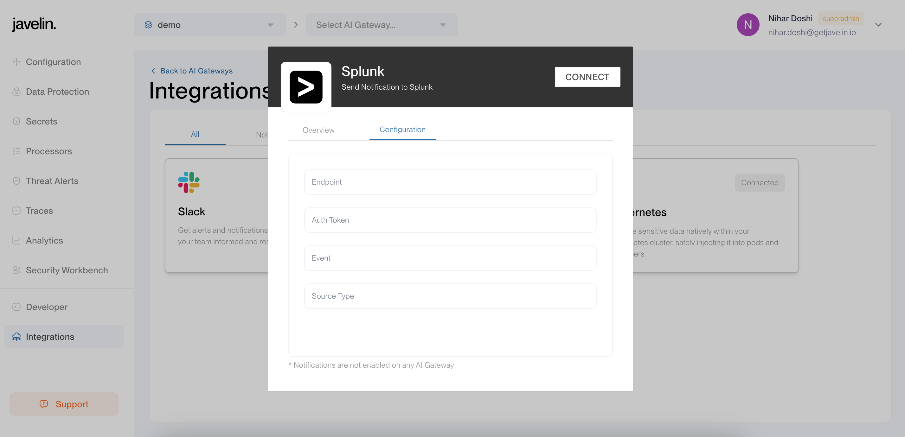
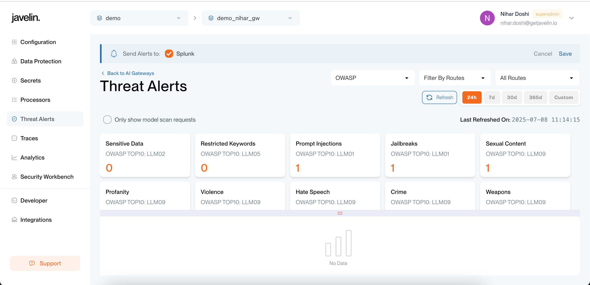

# Alert Integration

## Slack Alert Integration

To enable Slack alerting in Javelin, you'll need to configure a Slack webhook to allow Javelin to send messages to your Slack channel.

:::tip Need help creating a Slack webhook?
Refer to the [Slack Webhook Setup Guide](/docs/javelin-admin/alerts/slack/overview.md) for step-by-step instructions.
:::

#### 1. **Navigate to the Integrations Page**

From the side navigation, select `Integrations`.



#### 2. **Configure the Slack Integration**

Click on the Slack integration card and provide the required details, such as the webhook URL.



#### 3. **Enable Slack in Threat Alerts**

To start receiving alerts in Slack:
 - Go to the `Threat Alerts` page.
 - Click `Manage Notification` for your desired gateway.
 - Enable `Slack` to send alerts for that gateway.



## Splunk Alert Integration

To enable Splunk alerting in Javelin, you must configure the HTTP Event Collector (HEC) in Splunk. You'll need the following:
 - Base URL of your HEC endpoint
 - Authentication token
 - A payload including required fields like `event` and `sourcetype`

:::tip Need help setting up HEC in Splunk?
Refer to the [Splunk HEC Setup Guide](/docs/javelin-admin/alerts/splunk/overview.md) for detailed instructions.
:::

#### 1. **Visit the Integrations Page:**

In the left-hand navigation panel, click on `Integrations`.


#### 2. **Select the Splunk integration**

Click on the Splunk integration card and fill in the required fields: Base URL, Token, and Sourcetype.

:::note
Ensure that the sourcetype value matches the one configured in your Splunk HEC setup.
:::



#### 3. **Move to Threat-Alert Page:**

- Navigate to the `Threat Alerts` section.
- Click `Manage Notification` for your chosen gateway
- Enable `Splunk` as the alert destination.



<!-- This setup enables Javelin to send alerts to both Slack and Splunk effectively. -->

## Advance Configuration for Alert in Javelin

By default, alerts in Javelin are generated per gateway. However, for more granular control over when alerts should be triggered, Javelin also supports advanced configurations via the `trigger_condition` field in the alert integration configuration.

### 🛠️ Supported `trigger_condition` Fields

The following fields are supported for fine-tuned alerting:

| Field          | Type  | Description                                                                                                            |
| -------------- | ----- | ---------------------------------------------------------------------------------------------------------------------- |
| `threats`      | array | Specify one or more threat types (e.g., `["prompt_injection_detected", "jailbreak_detected"]`) to trigger alerts only for those threats. |
| `route_names`       | array | Specify one or more route names to restrict alerting to specific routes.                                               |
| `gateway_ids`     | array | Specify one or more gateway IDs. This is the default behavior in the UI.                                               |
| `application_ids` | array | Specify one or more application IDs to limit alerts to specific applications.                                          |

<!-- Click here to get list of [threats] -->
Click [here](/docs/javelin-admin/threats/overview.md) to view the full list of supported threat types that can be used in the `trigger_condition.threats` array.

### How to Configure

To configure alerts using these fields, perform an update call on the alert configuration, passing the desired `trigger_condition` in the request body. Example:

```json

curl --location --request PUT '<your_domain_url>/v1/admin/integrations/config/<alert-id>' \
--header 'x-api-key: <your-javelin-api-key>' \
--header 'Content-Type: application/json' \
--data '{
    ... your_existing_config
   "trigger_condition": {
    "threats": ["prompt_injection_detected", "jailbreak_detected"],
    "route_names": ["openai_gpt4_chat", "anthropic_claude"],
    "gateway_ids": ["gwy1"],
    "application_ids": ["app_xyz"]
  }
}'

```

:::note 
1. All fields in `trigger_condition` are optional and can be used independently or in combination.
2. All fields accept arrays, allowing for multiple values per field.
:::

<!-- ## Steps to Configure an Alert -->

<!-- To configure an alert in the Javelin application, follow these steps: -->

<!-- ### 1. Create a New Alert

Perform a **POST** request to:

```
https://your-api-domain.com/v1/admin/alerts/config
```

with the following JSON body:

### Important Configuration Fields

- **name**: The name of the alert configuration.
- **receiver_type**: Can be `slack` or `splunk`.
- **enabled**: Boolean value (`true` or `false`) indicating if the alert is active.
- **configuration**: Contains specific parameters based on the receiver type.
    - For **Slack**, Javelin requires:
        - `webhook_url`: The Slack webhook URL.
    - For **Splunk**, Javelin requires:
        - `endpoint`: The Splunk HEC endpoint.
        - `token`: The authentication token.
        - `payload`: Contains `event` and `sourcetype`.
- **trigger_condition**: Specifies when the alert should be triggered (e.g., matching threat types).
    - The alert is triggered when any of the specified conditions match.
    - Supported fields:
        1. **account_ids**: Can contain a list of account IDs to trigger alerts based on specific accounts.
        2. **gateway_names**: Can contain a list of gateway names to trigger alerts based on specific gateway.
        3. **application_ids**: Can contain a list of application IDs to trigger alerts based on specific applications.
        4. **route_names**: Can contain a list of route names to trigger alerts when specific routes are accessed.
        5. **threats**: Can contain a list of threats; the alert is triggered when any of these threats are detected.
- **severity**: Defines the severity level of the alert (`low`, `medium`, `high`).

### Example Alert Configuration (Splunk)

```json
{
    "name": "Splunk alert",
    "receiver_type": "splunk",
    "enabled": true,
    "configuration": {
        "token": "<token>",
        "payload": {
            "event": "Javelin trigger",
            "sourcetype": "<sourcetype>"
        },
        "endpoint": "https://<splunk_url>:<port>/services/collector/raw"
    },
    "trigger_condition": {
        "threats": [
            "prompt_injection_detected",
            "sensitive_data_replaced"
        ]
    },
    "severity": "high"
}
```

---

### 2. Update an Existing Alert

To update an alert configuration, perform a **PUT** request to:

```
https://your-api-domain.com/v1/admin/alerts/config/<alert_id>
```

with the full alert configuration including any updated fields.

Ensure you send the complete payload, not just the modified fields.

This allows Javelin to properly store and apply the updated alert settings. -->