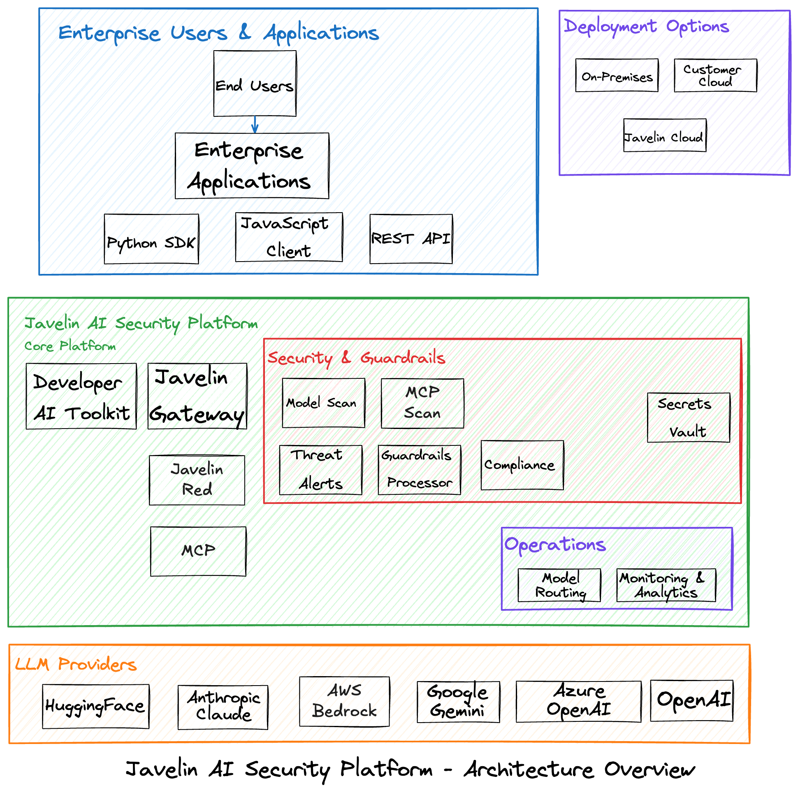
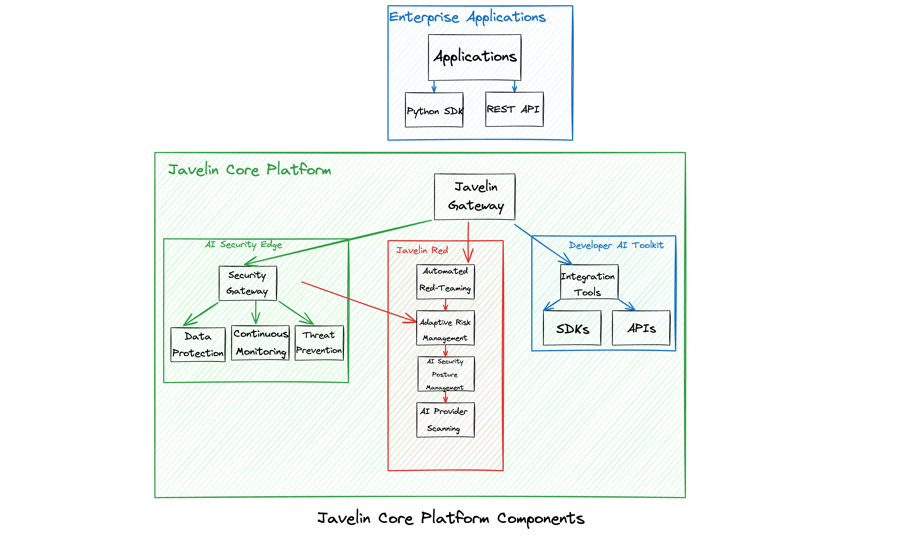
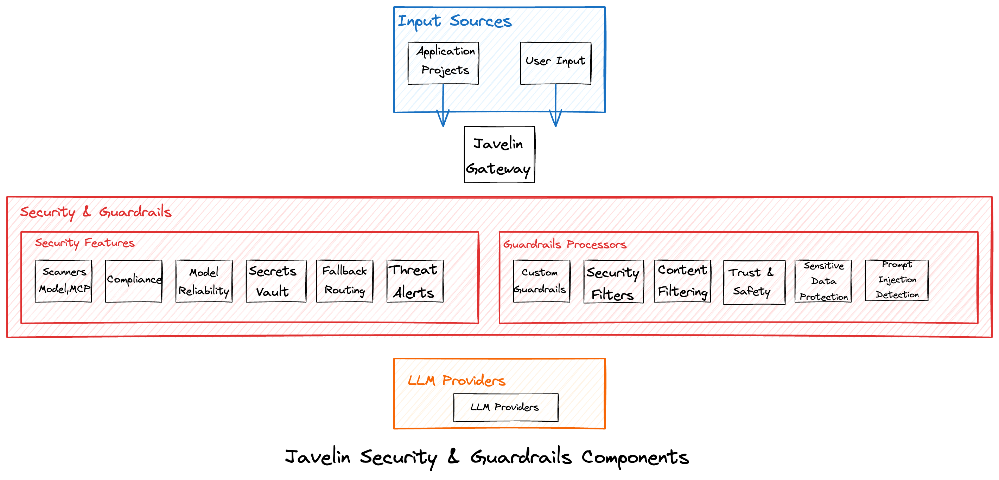
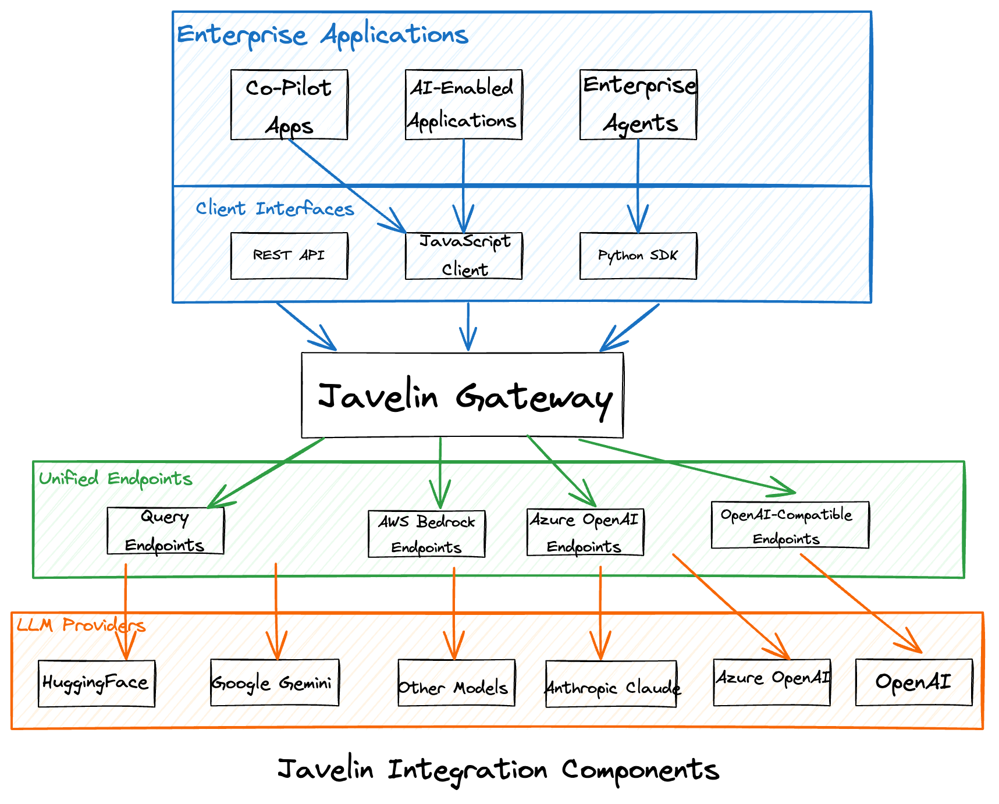
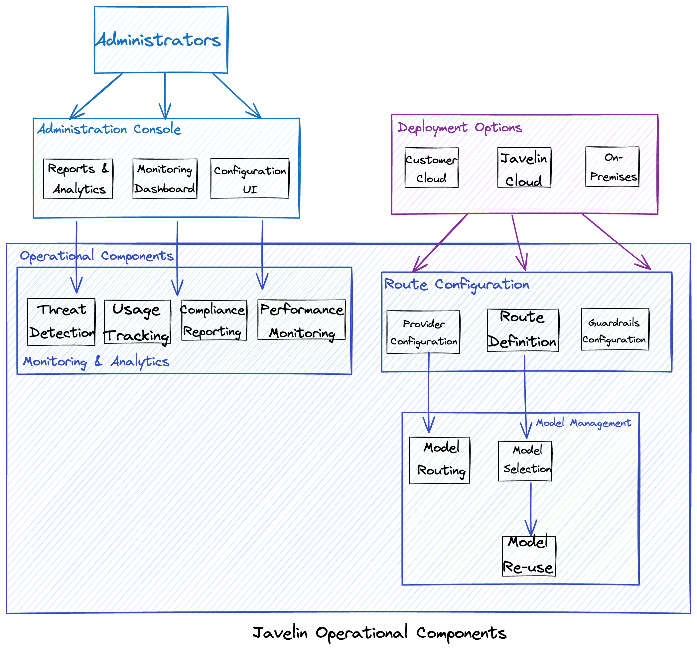

# Platform Architecture

## Executive Summary

Javelin provides an enterprise AI security platform designed for organizations to leverage AI technology securely and responsibly. The platform offers a secure AI gateway that protects all data exchanged with AI models, enabling teams to quickly adapt to emerging AI opportunities while maintaining security, compliance, and governance.

This technical architecture document provides a comprehensive overview of the Javelin platform components, their relationships, and integration capabilities.

## Table of Contents

1. [Architecture Overview](#architecture-overview)
2. [Core Platform Components](#core-platform-components)
3. [Security & Guardrails Components](#security--guardrails-components)
4. [Integration Components](#integration-components)
5. [Operational Components](#operational-components)
6. [Deployment Options](#deployment-options)
7. [Data Flow](#data-flow)
8. [Technical Specifications](#technical-specifications)

## Architecture Overview

The Javelin AI Security Platform provides a unified solution for enterprises to securely leverage AI technologies, particularly Large Language Models (LLMs). The platform sits between enterprise applications and various LLM providers, offering centralized management, security, and governance.

### Key Architecture Principles

1. **Centralized Gateway**: All LLM traffic routes through the Javelin Gateway, providing a single point for security, monitoring, and governance.

2. **Provider Abstraction**: Unified endpoints abstract provider-specific details, enabling consistent integration regardless of the underlying LLM provider.

3. **Security by Design**: Comprehensive guardrails and security features protect against threats, data leakage, and compliance violations.

4. **Flexible Deployment**: Support for cloud-hosted, customer cloud, or on-premises deployment models.

5. **Developer-First Approach**: APIs and SDKs enable developers to easily integrate AI security features into applications.

## Core Platform Components

The core of the Javelin platform consists of several key components that work together to provide secure AI capabilities.

### Javelin Gateway

The Javelin Gateway is the central routing mechanism for all LLM traffic. It:
- Provides a unified API interface to various LLM providers
- Routes requests through appropriate guardrails and security filters
- Enables centralized management, governance, and security
- Supports standardized request/response formats

### AI Security Edge

The AI Security Edge component provides:
- Secure AI gateway that protects all data exchanged with AI models
- Enterprise controls for AI traffic
- Continuous monitoring of AI interactions
- Automated threat prevention
- Data security, compliance, and future-readiness capabilities

### Javelin Red

Javelin Red provides proactive AI risk management through:
- Automated red-teaming to identify potential vulnerabilities
- Adaptive risk management based on emerging threats
- Comprehensive AI Security Posture Management
- Scanning of all AI providers to deliver a 360-degree view of usage and threats

### Developer-First AI Toolkit

The Developer-First AI Toolkit enables developers to:
- Integrate advanced AI security features into applications
- Customize security controls based on application needs
- Leverage APIs and SDKs for seamless integration
- Implement security features with minimal code changes

## Security & Guardrails Components

Javelin provides comprehensive security and guardrails to protect AI interactions and ensure responsible use.

### Guardrails Processors

The platform includes several guardrails processors:

1. **Prompt Injection & Jailbreak Detection**
   - Identifies and blocks attempts to manipulate or bypass AI system constraints
   - Prevents unauthorized access to system capabilities

2. **Sensitive Data Protection**
   - Detects and redacts sensitive information in both prompts and responses
   - Prevents data leakage and protects privacy

3. **Trust & Safety**
   - Ensures AI interactions adhere to ethical guidelines
   - Prevents harmful, illegal, or inappropriate content

4. **Content Filtering**
   - Filters out unsafe, inappropriate, or non-compliant content
   - Customizable based on organizational policies

5. **Security Filters**
   - Protects against security threats and vulnerabilities
   - Prevents exploitation of AI systems

6. **Custom Guardrails**
   - Allows organizations to define custom security rules
   - Enables industry-specific or organization-specific controls

### Security Features

Additional security features include:

1. **Threat Alerts**
   - Real-time detection and alerting of potential threats
   - Proactive notification of security incidents

2. **Fallback Routing**
   - Automatic rerouting in case of provider failures
   - Ensures service continuity and reliability

3. **Secrets Vault**
   - Secure storage of API keys and credentials
   - Centralized management of authentication information

4. **Model Reliability**
   - Ensures consistent and reliable model performance
   - Monitors and addresses model degradation

5. **Compliance**
   - Enforces regulatory compliance requirements
   - Provides audit trails and compliance reporting

6. **Model Scan**
   - Scans models for vulnerabilities and biases
   - Ensures models meet security and ethical standards

## Integration Components

Javelin provides flexible integration options to connect enterprise applications with various LLM providers.

### Enterprise Applications

Javelin supports various types of enterprise applications:
- AI-Enabled Applications
- Co-Pilot Apps
- Enterprise Agents

### Client Interfaces

Multiple client interfaces are available:
- REST API for standard HTTP-based integration
- Python SDK for Python applications
- JavaScript Client for web applications

### Unified Endpoints

Javelin provides unified endpoints that abstract provider-specific details:
- OpenAI-Compatible Endpoints
- Azure OpenAI Endpoints
- AWS Bedrock Endpoints
- Query Endpoints

### LLM Provider Support

Javelin integrates with various LLM providers:
- OpenAI (GPT models)
- Azure OpenAI
- Google Gemini
- Anthropic Claude
- HuggingFace models
- Other supported models

## Operational Components

Javelin includes operational components for administration, configuration, and monitoring.

### Administration Console

The Administration Console provides:
- Configuration UI for setting up routes, providers, and guardrails
- Monitoring Dashboard for real-time visibility
- Reports & Analytics for usage and performance insights

### Route Configuration

Route Configuration enables:
- Route Definition to specify how requests are handled
- Provider Configuration to set up LLM provider connections
- Guardrails Configuration to define security controls

### Model Management

Model Management features include:
- Model Selection to choose appropriate models for specific use cases
- Model Routing to direct requests to the right models
- Model Re-use to leverage models across multiple applications

### Monitoring & Analytics

Monitoring & Analytics capabilities include:
- Usage Tracking to monitor consumption and costs
- Threat Detection to identify security issues
- Performance Monitoring to ensure optimal operation
- Compliance Reporting to meet regulatory requirements

## Deployment Options

Javelin offers flexible deployment options to meet various organizational needs:

1. **Javelin Cloud**
   - Fully managed SaaS offering
   - Quickest deployment option
   - Managed by Javelin team

2. **Customer Cloud**
   - Deployed in customer's cloud environment
   - Greater control over infrastructure
   - Supports major cloud providers

3. **On-Premises**
   - Deployed within customer's data center
   - Maximum control and security
   - Meets strict data residency requirements

## Data Flow

The data flow through the Javelin platform follows these steps:

1. **Request Initiation**
   - Enterprise application sends request to Javelin Gateway
   - Request can come through REST API, Python SDK, or JavaScript client

2. **Gateway Processing**
   - Javelin Gateway receives the request
   - Request is authenticated and validated

3. **Guardrails Application**
   - Request is processed through configured guardrails
   - Sensitive data is protected, and security checks are applied

4. **Provider Routing**
   - Request is routed to the appropriate LLM provider
   - Routing is based on configured routes and model selection

5. **LLM Processing**
   - LLM provider processes the request
   - Response is generated by the selected model

6. **Response Processing**
   - Response is processed through security filters
   - Content is filtered based on configured guardrails

7. **Response Delivery**
   - Sanitized response is returned to the requesting application
   - Usage is logged for monitoring and analytics

## Technical Specifications

### API Interfaces

Javelin provides standardized API interfaces:

1. **REST API**
   - Standard HTTP-based API
   - JSON request/response format
   - Authentication via API keys

2. **Python SDK**
   - Native Python integration
   - Simple client initialization
   - Streamlined request handling

3. **JavaScript Client**
   - Browser and Node.js support
   - Promise-based interface
   - TypeScript definitions

### Supported LLM Providers

Javelin supports a wide range of LLM providers:

1. **OpenAI**
   - Base URL: `https://api.openai.com/v1`
   - Supported endpoints: /completions, /chat/completions, /embeddings

2. **Azure OpenAI**
   - Base URL: `https://{your-resource-name}.openai.azure.com`
   - Similar endpoint structure to OpenAI

3. **Google Gemini**
   - Integration via Javelin's unified endpoints

4. **Anthropic Claude**
   - Integration via AWS Bedrock endpoints

5. **HuggingFace**
   - Integration via specialized HuggingFace integration

### Security Capabilities

Javelin provides robust security capabilities:

1. **Authentication & Authorization**
   - API key-based authentication
   - Role-based access control
   - Granular permissions

2. **Data Protection**
   - Encryption in transit and at rest
   - PII detection and redaction
   - Sensitive data handling

3. **Compliance**
   - Audit logging
   - Compliance reporting
   - Regulatory controls

4. **Threat Protection**
   - Prompt injection detection
   - Jailbreak prevention
   - Content filtering

### Performance Considerations

Key performance considerations include:

1. **Scalability**
   - Designed to handle enterprise-scale workloads
   - Horizontal scaling capabilities
   - Load balancing across providers

2. **Latency**
   - Minimal overhead added to LLM requests
   - Optimized routing for performance
   - Caching capabilities for improved response times

3. **Reliability**
   - Fallback routing for provider failures
   - High availability design
   - Monitoring and alerting for issues

## Conclusion

The Javelin AI Security Platform provides a comprehensive solution for enterprises to securely leverage AI technologies. Its architecture is designed to provide centralized management, security, and governance while enabling flexible integration with various LLM providers. The platform's components work together to ensure that AI interactions are secure, compliant, and aligned with organizational policies.

By implementing Javelin, organizations can accelerate their AI adoption while maintaining control over how AI is used within their environment. The platform's security features protect against threats and data leakage, while its operational components provide visibility and management capabilities.
