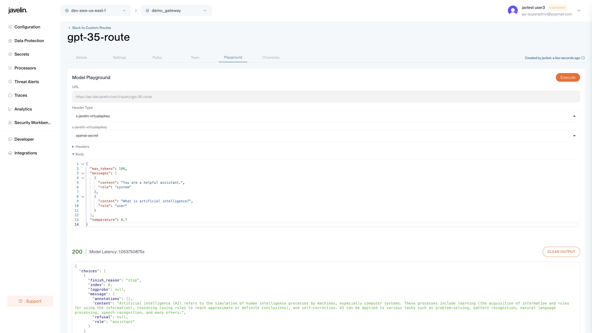

# Model Playground

The Model Playground provides a simple interface to test model routes and generate shareable inputs and outputs.

Instead of relying solely on raw JSON or API tools, the Playground offers a clean UI to:

- Select header type or manually set headers
- Compose prompts using a structured message format
- Customize language model parameters such as `temperature`, `logprobs`, `max_tokens`, etc.
- View model latency and content safety filter results

