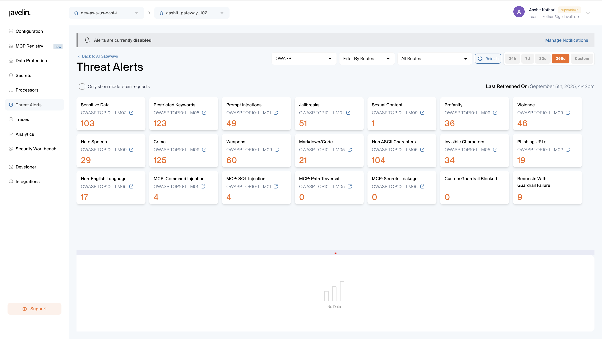
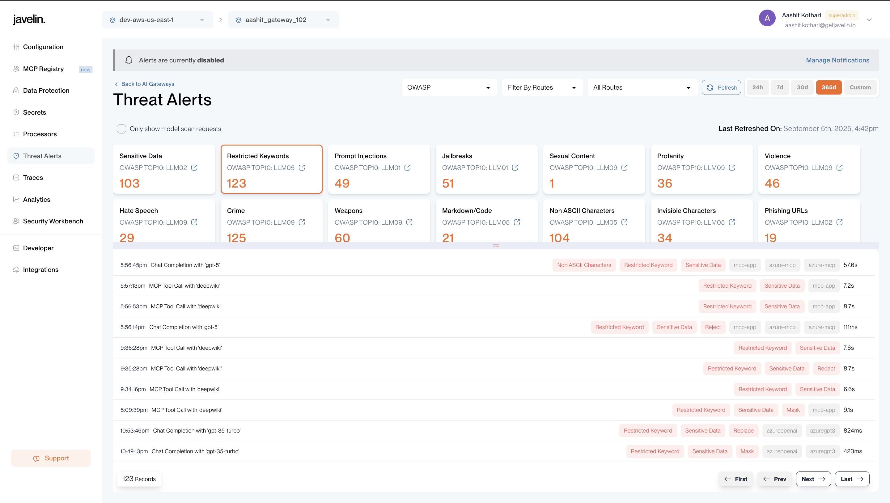
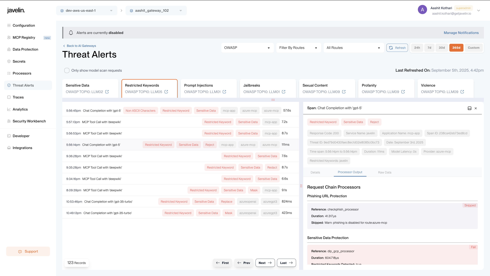
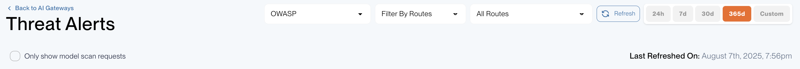

# Overview
The **Threat Alert Page** provides a comprehensive overview of security threats identified during interactions with large language models (LLMs). It focuses on detecting and analyzing vulnerabilities such as **prompt injections**, **jailbreak attempts**, **code/markdown content**, **restricted keywords**, and exposures of sensitive data, including **PII**, **PHI**, and **regex-based patterns**. This page enables users to efficiently evaluate risks across different threat categories and take necessary actions to safeguard their systems and sensitive information.

## Key Features
### Centralized Hub for Security Incidents 
The **Threat Alerts** feature is your new command center for monitoring and managing sensitive 
requests and security incidents.

### Centralized Tracking of Sensitive Requests 
Aggregate key security events into one easy-to-navigate page.

### Alert Categories 
- Sensitive Data 
- Prompt Injections 
- Jailbreak Attempts 
- Restricted Keywords 
- Markdown/Code Alerts

### Interactive Filters 
Click on any category metric card to filter the requests that match the metric accordingly.

### Comprehensive Request List View
We provide a detailed list view, including fields with quick access to easily scan and identify 
requests that require attention:
- Request Time 
- Model Name (e.g., gpt4o) 
- Provider (e.g., OpenAI) 
- Request Status (success, exceptions) 
- Sensitive Data Indicators (masked, replaced, redacted) 
- Duration 
 
 
 
### Detailed Request Insights 
You can click on any row to open a Right Panel View that displays detailed information including 
request, response data, processor outputs to see which guardrails were applied with name, 
latency and success/failure. Additional metadata is also available to identify: 
- Infotype Categories detected (PII, PHI etc.,) 
- Reserved Keywords or Regex Matches 
Each request is automatically tagged with relevant categories for easy identification, which 
helps you focus on the most critical issues first.

### Flexible Time Filters
Customize your view with time-based filtering for last 24 hours, 7 days, 30 days or 365 days.

